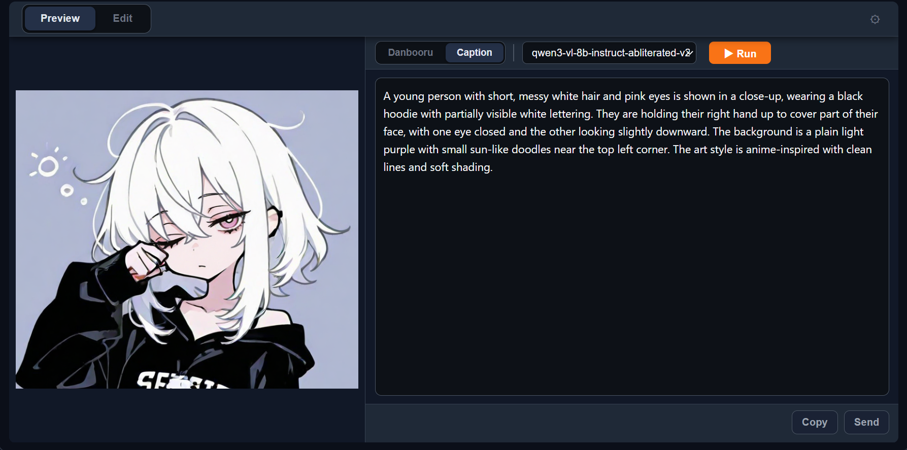
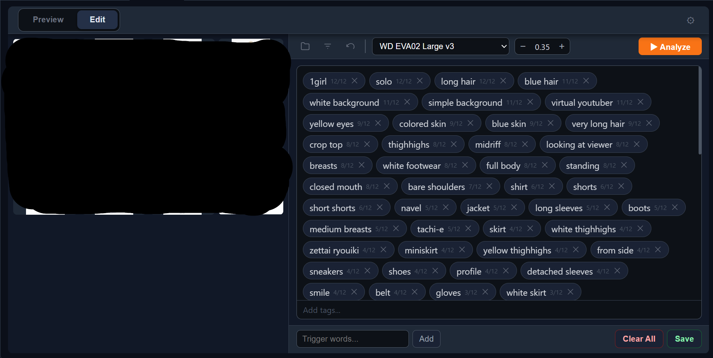

# sd-webui-taggitor

Stable Diffusion WebUI Forge NEO 向けのタグ付け・編集拡張機能です

## 機能

### Preview（参照）モード



- 画像からDanbooruタグを解析・表示
- 画像からローカルLLMでキャプション生成(要LM Studio)
- 結果をクリップボードにコピー、またはtxt2imgに送信

### Edit（編集）モード



- フォルダ指定で一括タグ付け
- 単体、複数編集も可能
- チップ形式でタグを確認・削除
- 下部の入力欄からタグを一括追加
- **Trigger words**: フッターの入力欄から全画像に追加
- **Sort**: アルファベット順 / 頻度順のトグル切り替え
- **Undo**: 操作取消
- **Save**: 変更をtxtファイルに保存

## インストール方法

1. WebUI を起動
2. **Extensions** タブ → **Install from URL** を開く
3. 以下のURLを貼り付けて Install をクリック：
   ```
   https://github.com/ranran141/sd-webui-taggitor
   ```
4. WebUIを再起動
5. **Taggitor** タブが作成されていればインストール完了

## 動作環境

- Stable Diffusion WebUI Forge NEO

## 解析モデルについて

### Danbooru タグ解析（WD14）

[SmilingWolf](https://huggingface.co/SmilingWolf) 氏が公開している WD14 ONNX モデルを使用しています。  
初回使用時はUI上のモデル選択から自動でダウンロードできます。

| モデル | 特徴 |
|--------|------|
| [WD ViT v3](https://huggingface.co/SmilingWolf/wd-vit-tagger-v3) | 汎用・バランス型。速度と精度のバランスが良い（推奨） |
| [WD SwinV2 v3](https://huggingface.co/SmilingWolf/wd-swinv2-tagger-v3) | 高精度。v3世代の中で安定した検出率 |
| [WD EVA02 Large v3](https://huggingface.co/SmilingWolf/wd-eva02-large-tagger-v3) | 最高精度・低速。精度重視の最終確認向け |
| [WD MOAT v2](https://huggingface.co/SmilingWolf/wd-v1-4-moat-tagger-v2) | 軽量・高速。旧世代だが動作が安定 |

### ローカル LLM キャプション生成（Caption モード）

LM Studio がローカルで起動している必要があります。  
LM Studio のセットアップ方法は [LLMuse の README](https://github.com/ranran141/sd-webui-llmuse) を参照してください。

**VRAM 16GB の推奨モデル**: `Qwen3-vl-8B-Instruct (Q4_K_M)`

> **注意**: 必ず **`vl`** がついたビジョン対応モデルを使用してください。  
> `vl` のないモデルは画像を参照できません。

LLMuse と LM Studio を共用する場合は、上記の `vl` モデルを使用してください。  
LLMuse 推奨の `Qwen3-8B-Instruct` は `vl` なしのため画像非対応です。

## 更新履歴

### v2.0.0 (2026-05-21)
- UI 全面リニューアル
  - Preview / Edit の2タブ構成
  - フォルダ指定で全画像を一括タグ付
  - チップ形式タグ編集UI（追加・削除・ソート・操作取消）
  - トリガーワードをフッターから全画像に一括追加
  - Sort: アルファベット順 / 頻度順トグル
- Preview モードに Caption（LM Studio）キャプション生成を追加
- 不要機能（Replace、Select All ボタン）を削除

### v1.1.0 (2026-05-18)
- 参照モード追加（D&Dで画像読み込み、タグ確認・解析）
- UI 改善

### v1.0.0 (2026-05-18)
- 初回リリース
