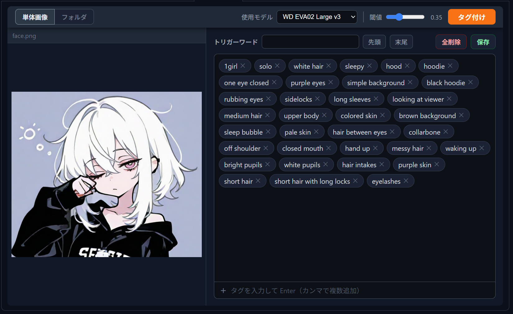

# sd-webui-taggitor

Stable Diffusion WebUI / Forge Neo / Reforge 向けのタグ編集拡張機能です



## 機能

- フォルダ内の画像を一覧表示し、タグをまとめて編集
- 単体画像モードでファイルを直接開いて編集
- WD14 ONNXモデルによる自動タグ付け（複数モデル対応）
- チップ形式のタグ編集UI（追加・削除・一括操作）
- トリガーワードを先頭または末尾に一括追加
- 複数画像選択時の共通タグ表示・一括削除・一括保存
- タグが空の場合はtxtファイルを作成しない

## インストール方法

1. WebUI を起動
2. **Extensions** タブ → **Install from URL** を開く
3. 以下のURLを貼り付けて Install をクリック：
   ```
   https://github.com/ranran141/sd-webui-taggitor
   ```
4. WebUIを再起動
5. **Taggitor** タブが作成されていればインストール完了

## 動作環境

- Stable Diffusion WebUI Forge NEO
- Stable Diffusion WebUI Reforge

## 自動タグ付けのモデルについて

初回使用時にモデルをダウンロードする必要があります。  
ダウンロードはUI上のモデル選択から自動で行えます。

対応モデル：
- WD ViT v3（バランス型・推奨）
- WD SwinV2 v3
- WD EVA02 Large v3
- WD MOAT v2

## 更新履歴

### v1.0.0 (2026-05-18)
- 初回リリース
